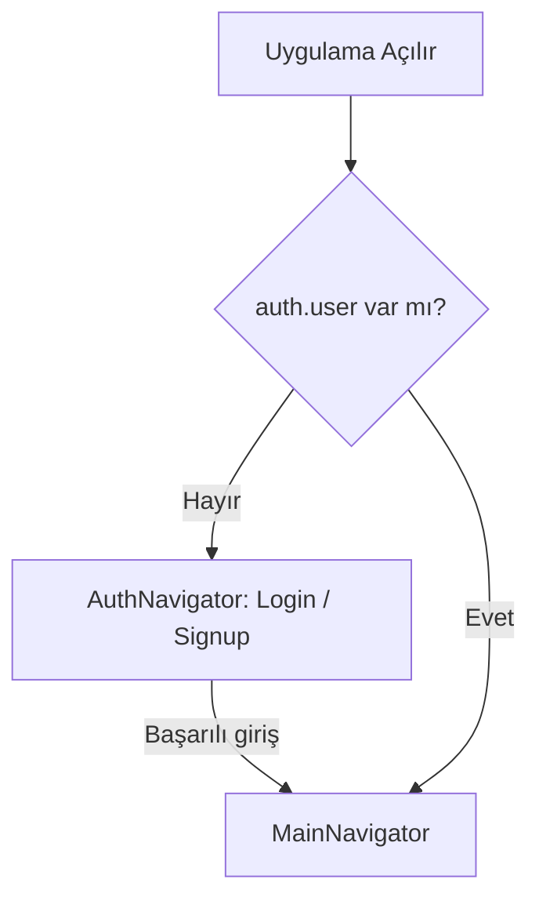
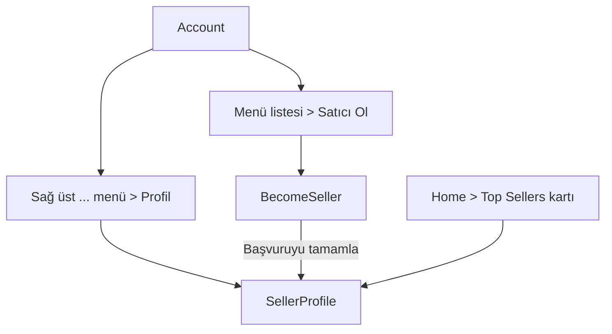
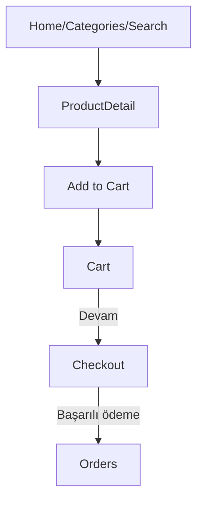
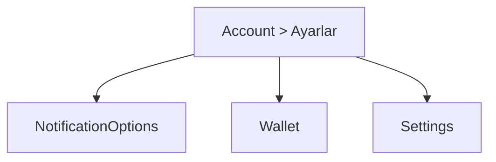

# Çok Satıcılı E-Ticaret Uygulaması — Navigasyon Akış Şeması

Bu doküman, uygulamada mevcut sayfalar (ekranlar) arasındaki yönlendirme kurallarını ve önerilen kullanıcı akışlarını standartlaştırmak için hazırlanmıştır. Tüm içerik Türkçe olup geliştirici ekip için referans niteliği taşır.

## 1) Genel Mimari

- Giriş Seviyesi Yönlendirme
  - App açılışında kimlik doğrulama durumu kontrol edilir.
  - Kimlik doğrulama yoksa AuthNavigator (Login/Signup), varsa MainNavigator açılır.

- MainNavigator (Stack)
  - Ana stack; Home, Categories, Search, Favorites, Cart, Account gibi ana sekmeler TabNavigator üzerinden gösterilir.
  - SellerProfile, BecomeSeller, Orders, Wallet, Settings, NotificationOptions gibi detay sayfalar stack içinde push edilir.

- TabNavigator (Bottom Tabs)
  - Sekmeler: Home, Categories, Search, Favorites, Cart, Account
  - SellerProfile gibi sayfalar sekme değildir; Account veya diğer akışlardan stack üzerinden açılır.

Önemli Rota İsimleri (örnekler):
- Home, Categories, Search, Favorites, Cart, Account
- SellerProfile, BecomeSeller, Orders, Wallet, Settings, NotificationOptions

## 2) Akış Şemaları (Mermaid)

### 2.1 Kimlik Doğrulama Akışı

### 2.2 Hesap (Account) ve Satıcı Akışı

Kurallar:
- Account ekranındaki ... modal menüden “Profil” seçimi doğrudan SellerProfile’a gider.
- Account menüsündeki “Satıcı Ol” seçimi BecomeSeller sayfasına gider; başarılı işlem ardından SellerProfile’a yönlendirilir.
- Home ekranındaki “Top Sellers” kartına dokunulunca ilgili satıcının SellerProfile’ı açılır (opsiyonel parametre: sellerId).

### 2.3 Ürün, Sepet ve Sipariş Akışı

Kurallar:
- Ürün detayından sepete ekle > Sepet > Ödeme (Checkout) > Başarılı sipariş sonrası Orders ekranı.
- Orders ekranından sipariş detayına dönüş (isteğe bağlı alt sayfa) yapılabilir.

### 2.4 Bildirimler, Cüzdan ve Ayarlar

Kurallar:
- Account ekranındaki üç nokta menüden “Bildirimler” NotificationOptions’a gider.
- Account menüsündeki “Cüzdanım” Wallet’a, “Ayarlar” Settings’e gider.

## 3) Yönlendirme Kuralları ve Örnekleri

- SellerProfile’a erişim yolları
  - Account > ... > Profil
  - Account > Satıcı Ol > (Başarı) > SellerProfile
  - Home > Top Sellers > Kart tıklaması > SellerProfile (sellerId ile)

- BecomeSeller sonrası davranış
  - Başvuru başarıyla tamamlandığında `navigate('SellerProfile')` yapılır.

- Modal menüler ve geri dönüş
  - Modal kapandıktan sonra ilgili rotaya geçilir (önce modalı kapatmak UX açısından önerilir).

- Sekme dışı sayfalar
  - SellerProfile gibi sekme olmayan ekranlar, bulunduğu yerden `navigate()` ile MainNavigator stack’ine push edilir.

## 4) Derin Link (Deep Linking) Önerileri

- turkiyemarketplace://seller/:sellerId → SellerProfile
- turkiyemarketplace://orders → Orders
- turkiyemarketplace://wallet → Wallet
- turkiyemarketplace://settings → Settings

Not: Uygun olduğunda params ile başlangıç sekmesi (ör. Home) ve alt hedef ekran (stack) belirlenebilir.

## 5) Hata Durumları ve Geri Dönüşler

- Satıcı profili bulunamadı / sellerId geçersiz
  - Kullanıcıya uyarı, ardından güvenli ekrana (Home veya Account) geri dön.

- Oturum sona erdi
  - Korumalı ekranlar istenirken oturum yoksa AuthNavigator’a yönlendir.

- Ağ hataları
  - Tekrar dene ve kullanıcıya durum bildir; kritik akışlarda (ödeme vb.) idempotent çağrı stratejisi.

## 6) Redux ve Route Parametreleri Notları

- Seri hale getirilebilirlik uyarıları için middleware ayarları yapılmıştır (örn. `auth/loginSuccess` ve belirli tarih alanları yok sayılır).
- Route parametreleri mümkün olduğunca sade ve seri hale getirilebilir tipler olmalıdır (string/number/boolean).

## 7) Test Kontrol Listesi (Smoke Tests)

- Auth
  - Oturumsuz açılış → AuthNavigator
  - Oturumlu açılış → MainNavigator

- SellerProfile erişimi
  - Account > ... > Profil
  - Account > Satıcı Ol > Başarı → SellerProfile
  - Home > Top Sellers kartı → SellerProfile (sellerId ile)

- Sipariş akışı
  - Ürün detay > Sepet > Checkout > Orders’a yönlendirme

- Diğer
  - Account > Cüzdanım → Wallet
  - Account > Ayarlar → Settings
  - Account > ... > Bildirimler → NotificationOptions

## 8) Dosya Haritası (Referans)

- Navigasyon
  - src/navigation/AppNavigator.tsx
  - src/navigation/AuthNavigator.tsx
  - src/navigation/MainNavigator.tsx
  - src/navigation/TabNavigator.tsx

- Ekranlar (örnekler)
  - src/screens/main/AccountScreen.tsx
  - src/screens/main/SellerProfile.tsx
  - src/screens/main/BecomeSeller.tsx
  - src/screens/main/OrdersScreen.tsx, WalletScreen.tsx, SettingsScreen.tsx, NotificationOptions.tsx
  - src/screens/main/HomeScreen.tsx (Top Sellers kart navigasyonu)

Bu doküman, uygulamadaki yönlendirme kararlarını tek bir yerde toplamayı ve ekip içinde tutarlılığı artırmayı amaçlar. Yeni ekranlar eklendikçe Mermaid akışları ve kurallar güncellenmelidir.